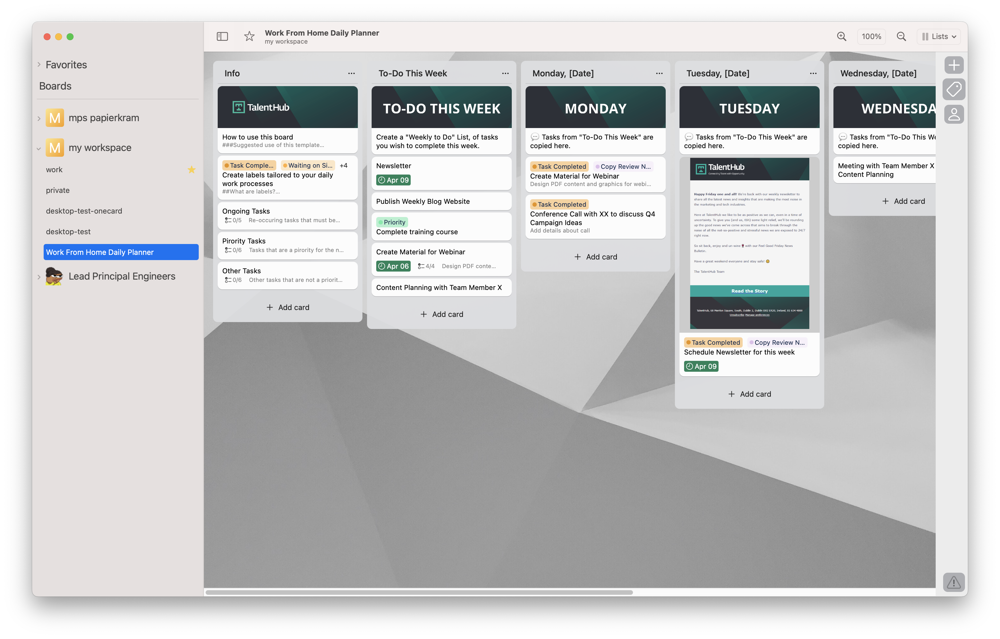

# trello app

This is a pet project of mine to learn more about Swift and SwiftUI. It's a native macOS app
for trello.

## Features

- [ ] Boards
  - [x] List all boards
  - [x] Switch active board
  - [x] Show board background image
  - [ ] Board settings
  - [ ] Manage labels
- [ ] Lists
  - [x] View lists
  - [x] View cards in a list
  - [x] Reorder cards in a list
  - [x] Change list name
  - [ ] Change list order
  - [x] Add list to board
  - [x] Delete/archive list
- [ ] Cards
  - [x] View card info
  - [x] Show card due date
  - [x] Show card labels
  - [ ] Hover actions
    - [x] Press "m" to move
    - [x] Press "d" to change due date
    - [x] Press "c" to change card color
    - [x] Press "l" to manage labels
  - [ ] Card details
    - [x] View description as rendered markdown
    - [x] Change due date
    - [x] Edit description
    - [ ] Comments
    - [ ] Attachments
    - [ ] Activity
